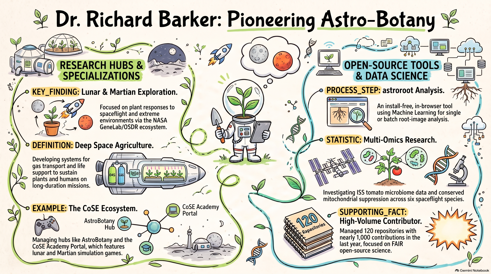

# Dr. Richard Barker

**Space Biology Researcher · Bioinformatician · Scientific Game Designer**  
*Science definition team member, [LEAF (Lunar Effects on Agricultural Flora)](https://www.spacelabtech.com/lunar-payload-leaf---lunar-effects-on-agricultural-flora.html), an Artemis III payload · Chair, NASA GeneLab Plant Analysis Working Group.*  
Director of **[The Collaborative Science Environment (CoSE)](https://www.cosecloud.com)**.

---

## 🌌 Research Focus & Mission

My research investigates how living systems—from cellular transcriptomes to canopy microclimates and whole human crews—adapt to the extreme environments of spaceflight, microgravity, cosmic radiation, and lunar/Martian regolith. 

Through the **Collaborative Science Environment (CoSE)**, my lab builds open-source computational tools, 3D anatomical atlases, computational fluid dynamics (CFD) models, and browser-playable serious simulations that turn complex spaceflight data into actionable scientific knowledge.

---

## 🚀 Thematic Project Hubs

| Hub | Focus Area | Live Link |
|---|---|---|
| ☁️ **CoSE Cloud** | Umbrella project directory and ecosystem hub connecting all CoSE space biology initiatives. | **[Launch CoSE Cloud](https://dr-richard-barker.github.io/CoSE_Cloud/Hub/)** |
| 🌱 **AstroBotany** | Curated hub of plant space-biology projects: microgravity omics, gravitropism, and spaceflight growth chambers. | **[Launch AstroBotany](https://dr-richard-barker.github.io/AstroBotany/)** |
| 🌾 **Deep Space Agriculture** | Closed-loop bioregenerative life support systems (BLSS), canopy gas exchange, and crop cultivation off Earth. | **[Launch DeepSpaceAg](https://dr-richard-barker.github.io/DeepSpaceAg/)** |
| 🎮 **CoSE Academy Portal** | Interactive educational impact assessment portal featuring 7 lunar & Martian serious games with split-screen simulators. | **[Launch Academy Portal](https://dr-richard-barker.github.io/dr-richard-barker/)** |
| 🩺 **Astronaut Health** | Spaceflight oncogenic biomarker discovery, muscle atrophy multi-omics, and dietary flavonoid countermeasure screens. | **[Launch Astronaut Health](https://dr-richard-barker.github.io/AstronautHealth/)** |

---

## 🔬 Four Core Scientific Pillars

### 1. Spaceflight Plant Multi-Omics & 3D Atlases
Grounded in real NASA Open Science Data Repository (OSDR) spaceflight data and peer-reviewed literature.
* **[Photorespiration Multi-Omics Microgravity](https://dr-richard-barker.github.io/Photorespiration_multiomics_microgravity/)** — Gas-transport FvCB model predicting the Arabidopsis spaceflight transcriptome across 6 flight studies (manuscript in preparation for *npj Microgravity*).
* **[Arabidopsis 3D Atlas](https://dr-richard-barker.github.io/arabidopsis-atlas/)** — Organ-selectable 3D model of *Arabidopsis thaliana* connected directly to OSDR transcriptomics.
* **[Rice Atlas](https://dr-richard-barker.github.io/rice-atlas/)** — Procedurally generated 3D rice-plant viewer: a conceptual model with no measured *Oryza sativa* data, and the starting point for the Arabidopsis Atlas.
* **[VEG-05 Integrated Omics](https://dr-richard-barker.github.io/veg05-integrated-omics/)** — Multi-omics analysis of ISS dwarf tomato (OSD-767 host transcriptome $\times$ OSD-766 microbiome).
* **[Tropism Autodecoder 2026](https://dr-richard-barker.github.io/Tropism_autodecoder_2026/)** — Auto-decoder pipeline deconvolving 1,337 OSDR/GEO bulk RNA-seq samples into cell types using the Salk single-nucleus Arabidopsis atlas.
* **[Plant Radiation Kinetic Landscape](https://dr-richard-barker.github.io/Plant_response_to_radiation/)** — Trajectory analysis resolving plant ionizing-radiation responses across 10 OSDR studies.
* **[DeepSpace Seed Stress Decoder](https://dr-richard-barker.github.io/deepspace-seed-stress-decoder/)** — Single-cell atlas identifying seed susceptibility to deep-space stressors.

### 2. Biophysics, CFD & Quantum Biology
Modeling the physical forces governing boundary-layer gas transport and quantum-level phenomena in microgravity.
* **[Quantum Biology Atlas](https://dr-richard-barker.github.io/quantum-biology-atlas/)** — Cross-species ontology and SBGN pathway maps for radical-pair, Fe-S, and flavin mechanisms linked to NASA OSDR.
* **[Lunar LEAF — Gas Exchange CFD](https://dr-richard-barker.github.io/LunarLeaf-CFD/)** — Validated in-browser lattice-Boltzmann CFD model of gravity-dependent gas exchange boundary layers from leaf to canopy.
* **[Spaceflight Hardware CFD](https://dr-richard-barker.github.io/spaceflight-plant-hardware-cfd/)** — OpenFOAM case setups for five flight chambers (BRIC, CARA, VEGGIE) across 4 gravity regimes; solver outputs are not yet in the repository.
* **[Microgreen Chamber CFD](https://dr-richard-barker.github.io/microgreen-chamber-cfd/)** — 3D internal-flow CFD of a microgreen chamber under varying gravity vectors.
* **[Statolith Physics Simulator](https://dr-richard-barker.github.io/Physics-simulator-for-statolith-modelling-/)** — Early-stage browser prototype for statolith sedimentation modelling (in development).
* **[4D Geospace Explorer](https://dr-richard-barker.github.io/earth-magnetosphere-4d-viz/)** & **[Lunar Magnetic Biology](https://dr-richard-barker.github.io/lunar-magnetic-biology/)** — Modeling planetary magnetic anomalies and shielding for biological systems.

### 3. Bioregenerative Life Support (BLSS), Regolith & Agronomy
Designing closed-loop ecosystems for sustainable lunar bases and deep-space missions.
* **[Lunar Farm BLSS Study](https://dr-richard-barker.github.io/LunarFarm-BLSS/)** — Reproducible study analyzing human-in-the-loop closed carbon loops (companion to Lunar Farm).
* **[Sintered Regolith for BLSS](https://dr-richard-barker.github.io/lunar-regolith-blss-review/)** — *From Dust to Bio-Infrastructure: Sintered Regolith Ceramics for Lunar BLSS* (review in preparation for *npj Microgravity*).
* **[AstroRegolith Database](https://dr-richard-barker.github.io/AstroRegolith/)** — Open database and growth-anchored reanalysis of plant growth in lunar, Martian, and asteroid regolith.
* **[Rothamsted Broadbalk Explorer](https://dr-richard-barker.github.io/Rothamsted_BroadBaulk/)** — 180+ years of continuous wheat crop yields and climate overlays informing space crop reliability.
* **[ARES Astromaterials Curation Client](https://dr-richard-barker.github.io/ares-curation/)** — FAIR client for NASA Apollo samples, planetary simulants, and 3D astromaterials.
* **[Space Mineral Atlas](https://dr-richard-barker.github.io/SpaceMineralAtlas/)** — Mining NASA LSDA & OSDR for dietary mineral transport (Ca, Mg, K, P) and bone/muscle countermeasures.

### 4. Astronaut Health & Countermeasures
Translating spaceflight multi-omics into preventive health strategies for human crews.
* **[Muscle Atrophy Multi-Omics](https://dr-richard-barker.github.io/Muscle-Atrophy-Multi-Omics-OSDR/)** — Multi-species transcriptomic analysis of disuse/spaceflight muscle atrophy and plant-based countermeasure screens.
* **[Astronaut Oncogene Biomarkers](https://dr-richard-barker.github.io/astronaut-oncogene-biomarkers/)** — Cross-tissue meta-analysis of convergent oncogenic pathways in astronauts across OSDR and JAXA.
* **[Astronaut Flavonoid Reversal Screen](https://dr-richard-barker.github.io/Astronaut_flavenoids_and_biomarkers/)** — Identifying food-derived flavonoid compounds that reverse spaceflight oncogenic expression via LINCS L1000.
* **[Astronaut Nutritional Countermeasures](https://dr-richard-barker.github.io/Astronaut_brain_food/)** — Translating consensus spaceflight transcriptomic signatures into dietary interventions.

---

## 🎮 Serious Simulations & The CoSE Academy

The **[CoSE Academy Portal](https://dr-richard-barker.github.io/dr-richard-barker/)** embeds playable, high-fidelity lunar and Martian management simulators inside a formal research evaluation framework. Students and researchers complete baseline hypotheses, launch real-time split-screen simulations, and record post-simulation system conclusions:

| Module | Title | Simulation Focus | Companion Scientific Work |
|---|---|---|---|
| **01** | 🏗️ **Lunar Habitat** | Regolith shielding, vertical excavation & radiation protection | [Regolith BLSS Review](https://dr-richard-barker.github.io/lunar-regolith-blss-review/) |
| **02** | 🚜 **Boring Mining** | Autonomous robotic mining, equipment degradation & resource competition | [ARES Sample Curation](https://dr-richard-barker.github.io/ares-curation/) |
| **03** | 🌾 **Lunar Farm** | Closed-loop 8x8 grow halls, LED power draw & water constraints | [LunarFarm-BLSS Paper](https://dr-richard-barker.github.io/LunarFarm-BLSS/) |
| **04** | 🎲 **Settlers of Moon/Mars** | Aerospace logistics, mycoponics & biotech life support | [Settlers Repo](https://github.com/dr-richard-barker/Settlers_of_the_Moon_or_Mars) |
| **05** | 🏈 **Brute Bowl** | Stochastic probability, LLM reasoning & team resource allocation | [LLM Game Theory](https://github.com/dr-richard-barker/Training_LLM_game-theory_using_bloodbowl) |
| **06** | ⚔️ **Lunar Red Alert** | Vacuum-environment logistics, real-time strategy & asset defense | [Lunar Red Alert](https://github.com/dr-richard-barker/Lunar_Red_Alert) |
| **07** | 🏙️ **Artemis City** | ISRU zoning interdependency, road/power/water network bottlenecks | [LunarSims Suite](https://dr-richard-barker.github.io/LunarSims/) |

---

## 🧰 Open-Source Laboratory & Phenotyping Tools

* **[CoSE Cell Segmenter](https://github.com/dr-richard-barker/cose-cell-segmenter)** — Desktop napari + Cellpose GUI for automated cell, nucleus, and fungal spore segmentation.
* **[AstroRoot](https://dr-richard-barker.github.io/astroroot/)** & **[AstroRoot Painter](https://dr-richard-barker.github.io/astroroot-painter/)** — In-browser root-image phenotyping and human-in-the-loop model training for classrooms.
* **[Germinator AI](https://dr-richard-barker.github.io/germinator-ai/)** — Time-lapse seed germination scoring and kinetic curve fitting in the browser.
* **[CoSE FIJI Bench](https://dr-richard-barker.github.io/cose-fiji/)** — ImageJ 1.54 in the browser with SmartRoot and plant-phenotyping presets.
* **[The Virtual Root](https://dr-richard-barker.github.io/virtual-root/)** — Web rebuild of SimuPlant modeling cellular auxin transport in root tips.
* **[NASA-IBM Lunar Foundation Model Explorer](https://dr-richard-barker.github.io/lunar-lfm-explorer/)** — Interactive multimodal viewer for lunar remote sensing diagnostics.

---

## 📬 Connect & Collaborate

* 🌐 **CoSE Cloud:** [cosecloud.com](https://www.cosecloud.com)
* 🐙 **GitHub:** [@dr-richard-barker](https://github.com/dr-richard-barker)
* 💼 **All Repositories:** [Browse 160+ Open Science Repos](https://github.com/dr-richard-barker?tab=repositories)

🌱🚀 Building open tools, FAIR data, and educational simulators for the future of space exploration.

---

